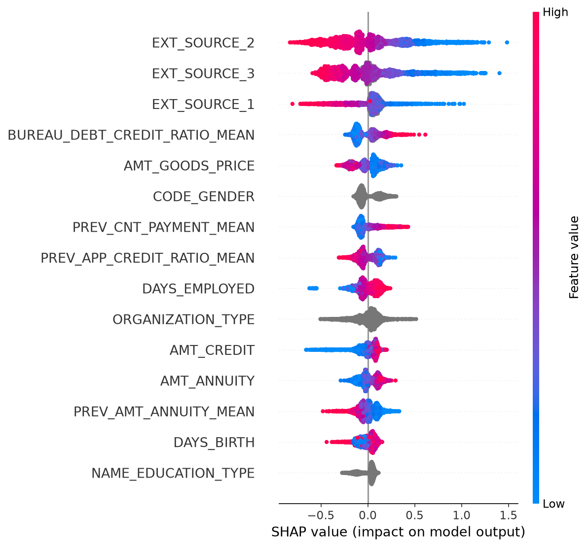

# credit-risk-scorecard 분석 리포트

생성일: 2026-09-04

## 1. 데이터 개요

- 데이터: Home Credit Default Risk `application_train.csv`, 307,511건
- 전처리 후 사용 변수 수(ID/TARGET 제외): 130
- IV 기준(0.02~0.5) 선택된 변수 수: 25

## 2. IV(Information Value) 상위 변수

| feature_name | iv_value | bin_count |
|---|---|---|
| EXT_SOURCE_3 | 0.3298 | 11 |
| EXT_SOURCE_2 | 0.3032 | 11 |
| EXT_SOURCE_1 | 0.1513 | 11 |
| BUREAU_DEBT_CREDIT_RATIO_MEAN | 0.138 | 10 |
| BUREAU_DAYS_CREDIT_MEAN | 0.12 | 11 |
| DAYS_EMPLOYED | 0.1116 | 11 |
| AMT_GOODS_PRICE | 0.0914 | 11 |
| BUREAU_ACTIVE_RATIO | 0.0888 | 8 |
| DAYS_BIRTH | 0.0868 | 10 |
| OCCUPATION_TYPE | 0.0754 | 13 |
| BUREAU_DAYS_CREDIT_MIN | 0.0734 | 11 |
| PREV_REFUSED_RATIO | 0.0691 | 5 |
| PREV_APPROVED_RATIO | 0.061 | 7 |
| ORGANIZATION_TYPE | 0.0596 | 17 |
| NAME_INCOME_TYPE | 0.0559 | 5 |

## 3. 모델 성능 비교 (챔피언-챌린저)

| model | AUC | KS | Gini |
|---|---|---|---|
| 로지스틱 (WoE 스코어카드, 베이스라인) | 0.7487 | 0.3752 | 0.4973 |
| LightGBM (고도화 모델) | 0.7709 | 0.4057 | 0.5417 |

**챔피언 모델: `lightgbm`**

- AUC 개선폭: +0.0222
- 판단 사유: LightGBM이 베이스라인 대비 AUC +0.0222pt 우세 (기준 0.01 초과) -> 챔피언으로 채택

## 4. 점수 스케일링 및 등급 설계

- PDO(Points to Double Odds) 방식: base_score=600, base_odds=50:1, pdo=20
- 등급: A(최우량, 저위험) ~ E(최고위험), 동일 인원수(quantile) 기준 5등급

| grade | count | avg_score | default_rate |
|---|---|---|---|
| A | 61502 | 605.0 | 0.0067 |
| B | 61502 | 586.4 | 0.0181 |
| C | 61502 | 572.0 | 0.0397 |
| D | 61502 | 555.4 | 0.0831 |
| E | 61503 | 526.3 | 0.2560 |

## 5. 컷오프 시뮬레이션

- 가정: LGD(Loss Given Default) = 45% (Basel 무담보 소매여신 표준 가정)

| cutoff score | approval_rate | expected_default_rate | expected_loss |
|---|---|---|---|
| 517.8 | 95.00% | 6.13% | 2.76% |
| 530.1 | 90.00% | 5.06% | 2.28% |
| 538.5 | 85.00% | 4.27% | 1.92% |
| 545.2 | 80.00% | 3.69% | 1.66% |
| 550.8 | 75.00% | 3.18% | 1.43% |
| 555.7 | 70.00% | 2.78% | 1.25% |
| 560.2 | 65.00% | 2.45% | 1.10% |
| 564.4 | 60.00% | 2.15% | 0.97% |
| 568.3 | 55.00% | 1.86% | 0.84% |
| 572.1 | 50.00% | 1.62% | 0.73% |
| 575.7 | 45.00% | 1.43% | 0.64% |
| 579.3 | 40.00% | 1.24% | 0.56% |
| 582.8 | 35.00% | 1.09% | 0.49% |
| 586.3 | 30.00% | 0.94% | 0.42% |
| 589.9 | 25.00% | 0.80% | 0.36% |
| 593.9 | 20.00% | 0.67% | 0.30% |
| 598.1 | 15.00% | 0.53% | 0.24% |
| 603.2 | 10.00% | 0.39% | 0.17% |
| 610.1 | 5.00% | 0.31% | 0.14% |

## 6. PSI(Population Stability Index) 안정성 점검

- 기준(expected)=train, 비교 대상(actual)=test 분포. 해석: PSI<0.1 안정, 0.1~0.25 중간 수준 변화, >0.25 유의미한 변화(재학습 검토 필요)

| target | period | psi_value | 해석 |
|---|---|---|---|
| score | test_vs_train | 0.0004 | 안정 |
| EXT_SOURCE_3 | test_vs_train | 0.0001 | 안정 |
| EXT_SOURCE_2 | test_vs_train | 0.0001 | 안정 |
| EXT_SOURCE_1 | test_vs_train | 0.0002 | 안정 |
| BUREAU_DEBT_CREDIT_RATIO_MEAN | test_vs_train | 0.0001 | 안정 |
| BUREAU_DAYS_CREDIT_MEAN | test_vs_train | 0.0001 | 안정 |

## 7. SHAP 해석

챔피언 모델(`lightgbm`)의 SHAP summary plot (테스트셋 샘플 기준):



## 8. 재현 방법

```bash
python run.py
pytest tests/
```

## 9. 참고

- 상세 진행 로그: [PROGRESS.md](PROGRESS.md)
- SQLite 스키마: [src/db.py](src/db.py)